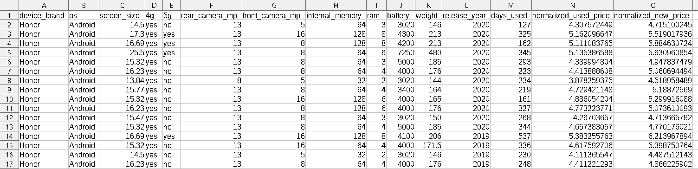
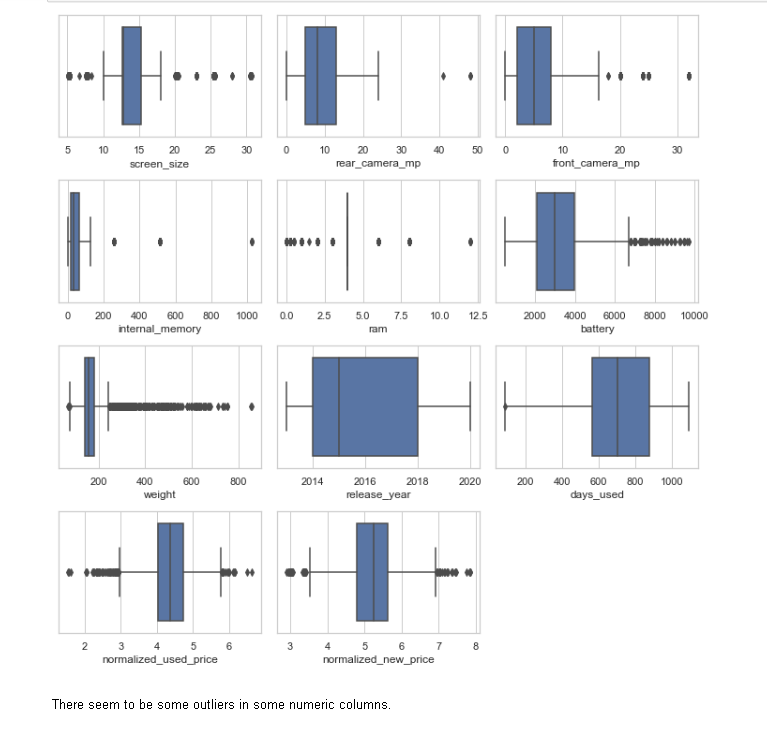
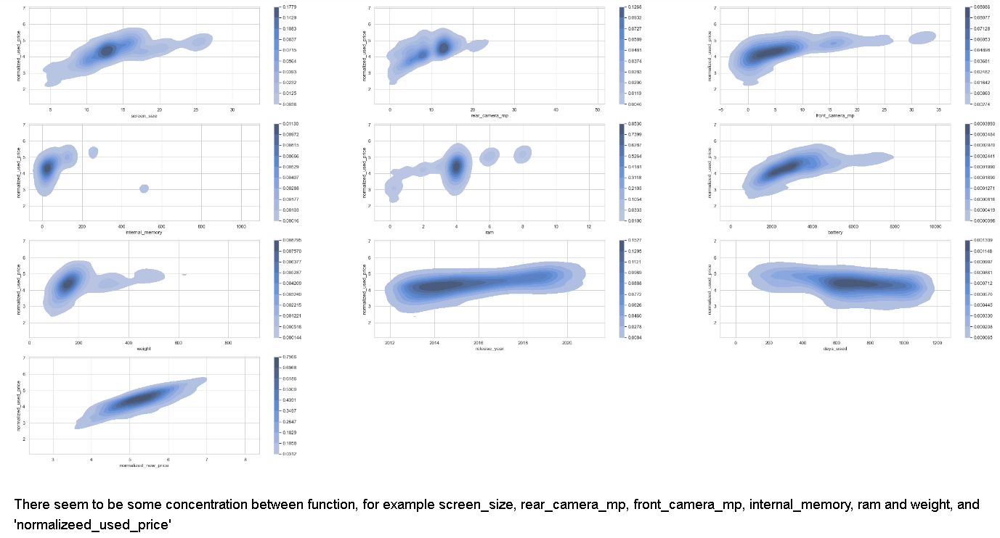
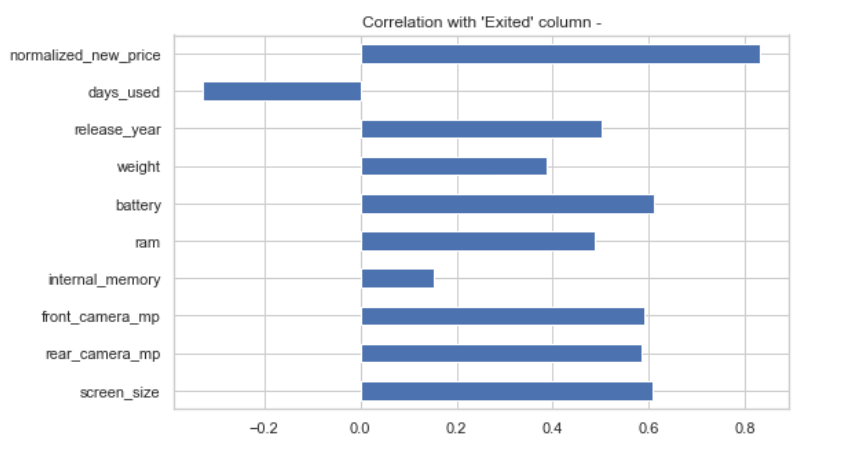
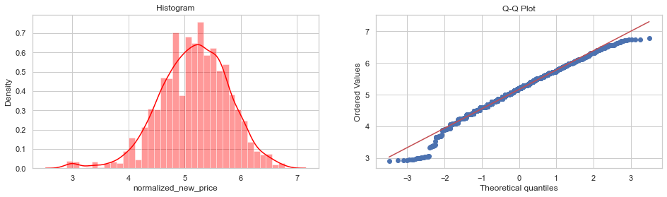
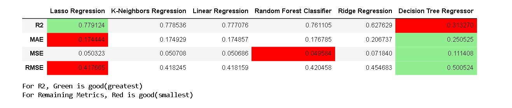
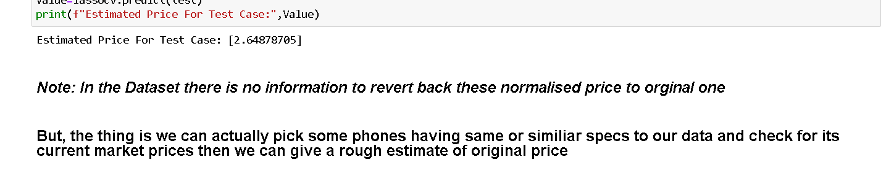

# Used-Mobile-Price-Prediction
Compares 6 Regression Models and picks the best to predict the used Phone Price.

I made some notes on some basic terms and some important explanations. You can read it . 

## Installation and Setup
```
git clone https://github.com/manipta/UsedMobilePricePredictor.git
```

## Data-set Examination 
The data set in CSV format is shown below:
<center></center>

* The data set has 3454 samples and 15 columns.

### After Normalizing 

* The data set has 3454 samples, 51 features, and 1 target variable.
* The test data set has 2000 samples and 51 features. 
* The target variable is the Normalised_Used_Price 

The data set is available here:
https://github.com/manipta/UsedMobilePricePredictor/blob/main/used_device_data.csv

## Exploratory Data Analysis
### Box Plot
<center></center>

Using Box Plot to check outliers

### KDE Plot for data features
<center></center>

Kernel Density Estimation Plot to know how features or data are distributed.

It helps to decide whether normalization techniques are required or not.

###  KDE Plot between target and features
<center></center>

It plots all features wrt our target(Used_mobile_price) so that we can check how the target value varies with the features.
It also helps to decide which correlation techniques we can use based on whether the data is normal.

### Correlation Plot
<center></center>

The correlation plot tells us how strongly features linearly relate to the target value.

### Q-Q Plot
<center></center>

Q-Q plot plots the relation of data with an expected normal distribution using a straight line.

## Regression Models Evaluation Meterics
<center></center>

Lasso Regression is best for this data.

## Final Predictions
<center></center>

This is the result from the data provided in the test.csv Just edit it, and you can predict for your data too.

## 🔗 **Follow Me**
[]
(https://bit.ly/mani_garg)[](https://www.linkedin.com/in/manigargpta/)
[](https://medium.com/@manipta)

